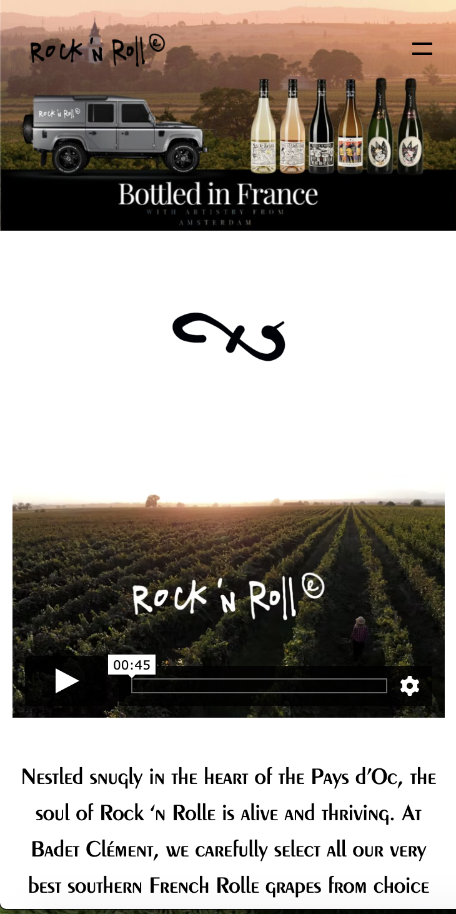
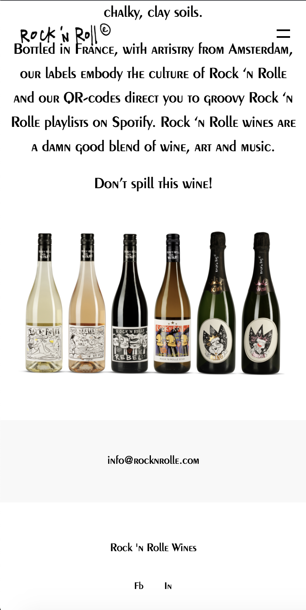
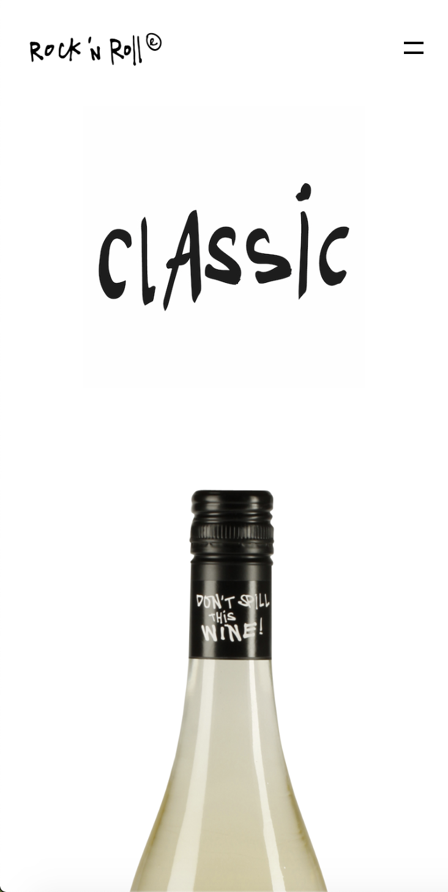
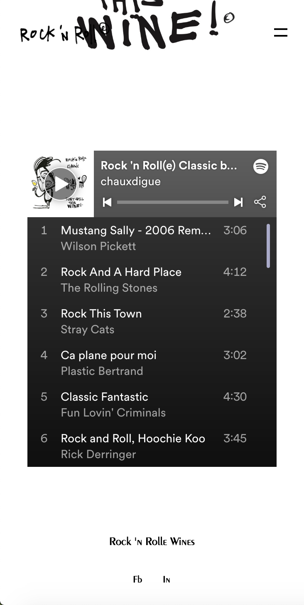
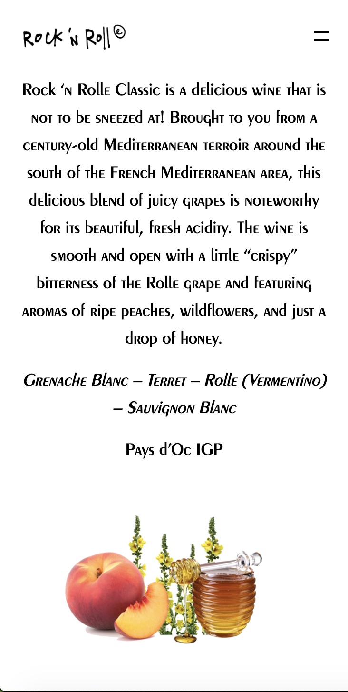
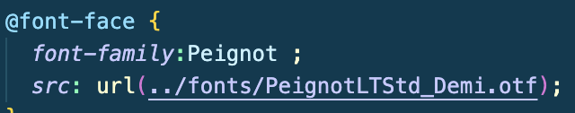

# Procesverslag
Markdown is een simpele manier om HTML te schrijven.  
Markdown cheat cheet: [Hulp bij het schrijven van Markdown](https://github.com/adam-p/markdown-here/wiki/Markdown-Cheatsheet).

Nb. De standaardstructuur en de spartaanse opmaak van de README.md zijn helemaal prima. Het gaat om de inhoud van je procesverslag. Besteedt de tijd voor pracht en praal aan je website.

Nb. Door *open* toe te voegen aan een *details* element kun je deze standaard open zetten. Fijn om dat steeds voor de relevante stuk(ken) te doen.

## Jij

  
uitwerken voor kick-off werkgroep

  ### Auteur:
  Bijou Kuijer 

  #### Je startniveau:
  Blauw 

  #### Je focus:
  responsive
 

## Je website

  
uitwerken voor kick-off werkgroep

  ### Je opdracht:
  https://www.rocknrolle.nl/
  #### Screenshot(s) van de eerste pagina (small screen): 
  hier de naam van de pagina  
  

  #### Screenshot(s) van de tweede pagina (small screen):
  hier de naam van de pagina  
  
 

## Toegankelijkheidstest 1/2 (week 1)

  
uitwerken na test in 1e werkgroep

  ### Bevindingen
  Lijst met je bevindingen die in de test naar voren kwamen:

  #### Screenreader
  Screenreader vond ik zelf erg moeilijk te gebruiken op zichzelf. Je komt best oke door de site heen. 

  Oplossing:
  De screenreader een minder saaie stem geven :)

  #### Muis en Toetsenbord 
  Hier korte omschrijving (met indien nodig afbeeldingen)
  Je komt goed door de hele site heen met de tab toets!

  #### Motoriek (shocks, elastiekjes)
  Het was erg lastig om de website de besturen met schokken, vooral omdat ik het een heel naar gevoel vond en er eigenlijk snel vanaf wilde.

  Oplossing: 
  Als je je arm ergens tegenaan leunde kon je makkelijker je hand controllen.

  #### Visueel (brillen, contrast, kleurenblind, dark/light). 
  De website was erg onduidelijk met een beperkte visie, het lettertype is er net te klein voor.

  Oplossing:
  groter lettertype

## Breakdownschets (week 1)

  
Ik was er tijdens deze werkgroep niet bij volgensmij, wel heb ik de breakdownschets zelf gemaakt thuis. Dat ging redelijk goed! de slides op dlo waren goed te volgen. Ik begon eerst met de grote dingen uitlijnen, zoals de body header main footer. Vervolgens heb ik alles verdeeld in section en daarna op de aparte content in gegaan.

  ### de hele pagina: 
  

  ### dynamisch deel (bijv menu): 
  

  ### wellicht nog een dynamisch deel (bijv filter): 
  

## Voortgang 1 (week 2)

  
uitwerken voor 1e voortgang

  ### Stand van zaken
  in de eerste week was ik nog helemaal niet ver. Het kost mij altijd even om te beginnen aan een opdracht... dit kwam ook gedeeltelijk omdat mijn Visual Studio Code de hele tijd crashte. Ik had wel alles al op mijn pagina kunnen zetten qua content. Ik moet eerlijk zeggen dat ik niet doorhad dat ik een groepje had, ik wist ook niet dat we vooraf met dat groepje moesten afspreken wat we eventueel wilden bespreken. Dat heb ik met de volgende voortgangs gesprekken daarom ook niet.

  ### Agenda voor meeting
  samen met je groepje opstellen

  | student 1      | student 2          | student 3    | student 4        |
  | ---            | ---                | ---          | ---              |
  | dit bespreken  | en dit             | en ik dit    | en dan ik dat    |
  | en dat ook nog | dit als er tijd is | nog een punt | dit wil ik zeker |
  | ...            | ...                | ...          | ...              |

  ### Verslag van meeting
  hier na afloop snel de uitkomsten van de meeting vastleggen

  - ik moet gewoon een begin gaan maken
  - zorg ervoor dat je alles benoemt alt tags etc.

## Voortgang 2 (week 3)

  
uitwerken voor 2e voortgang

  ### Stand van zaken
  In de tweede week stond ik er nogsteeds niet zo goed voor helaas, ik was erachter gekomen dat ik compleet was vergeten hoe css werkte. Gelukkig heeft 1 van de studentassistenten mij goed kunnen helpen. Hij heeft me geholpen met de basics, waardoor ik daarna makkelijk zelf verder kon.

  ### Agenda voor meeting
  samen met je groepje opstellen

  | student 1      | student 2          | student 3    | student 4        |
  | ---            | ---                | ---          | ---              |
  | dit bespreken  | en dit             | en ik dit    | en dan ik dat    |
  | en dat ook nog | dit als er tijd is | nog een punt | dit wil ik zeker |
  | ...            | ...                | ...          | ...              |

  ### Verslag van meeting
  hier na afloop snel de uitkomsten van de meeting vastleggen

  - hamburger menu uitzoeken
  - font-family erin gezet dat doe je met @font-Face en dan de url invoeren

## Toegankelijkheidstest 2/2 (week 4)

  
uitwerken na test in 8e werkgroep

  ### Bevindingen
  Lijst met je bevindingen die in de test naar voren kwamen (geef ook aan wat er verbeterd is):

  #### Screenreader
  Screenreader ging prima, omdat ik het zelf natuurlijk niet gewend ben vond ik het heel irritant gebruiken.

  Hier een omschrijving van hoe het opgelost kan worden (met indien nodig afbeeldingen)

  #### Muis en Toetsenbord 
  Hier korte omschrijving (met indien nodig afbeeldingen)
  Op de website werkte tab heel goed, ik kon door mijn hele website heen tabben!

  #### Motoriek (shocks, elastiekjes)
  Motoriek ging redelijk, soms waren de knoppen iets te klein om op te klikken.

  #### Visueel (brillen, contrast, kleurenblind, dark/light). 
  Kleur speelt op mijn website niet een hele grote rol, dus het contrast/kleurenblind werkte eigenlijk prima

## Voortgang 3 (week 4)

  
uitwerken voor 3e voortgang

  ### Stand van zaken
  Ik had in de vorige lessen samen met een klasgenoot mijn hamburger menu uitgevogeld. Ik wist dat ik hier hulp bij nodig zou hebben en ik ben ook erg blij dat ik dat heb gedaan! Mijn hamburger menu werkte en er was een kleine animatie in het kruisje. Het probleem nu was dat ik een transitie wilde maken voor het hamburger menu. Hier heeft Robert mij bij kunnen helpen! Na deze les was ik erg blij en had ik een goed gevoel over mijn website.

  ### Agenda voor meeting
  samen met je groepje opstellen

  | student 1      | student 2          | student 3    | student 4        |
  | ---            | ---                | ---          | ---              |
  | dit bespreken  | en dit             | en ik dit    | en dan ik dat    |
  | en dat ook nog | dit als er tijd is | nog een punt | dit wil ik zeker |
  | ...            | ...                | ...          | ...              |

  ### Verslag van meeting
  hier na afloop snel de uitkomsten van de meeting vastleggen

  - beginnen met de tweede webpage
  - Spotify playlist aan die pagina toevoegen?? uitzoeken hoe
  

## Eindgesprek (week 5)

  
uitwerken voor eindgesprek

  ### Je uitkomst - karakteristiek screenshots:
  
  
  
  
  
  ### Dit ging goed/Heb ik geleerd: 
  Korte omschrijving met plaatjes

  

  ### Dit was lastig/Is niet gelukt:
  Korte omschrijving met plaatjes

  
  

## Bronnenlijst

  
continu bijhouden terwijl je werkt

  Nb. Wees specifiek ('css-tricks' als bron is bijv. niet specifiek genoeg).

  1. Kevin zijn code voor hambirger menu
  2. https://statics.teams.cdn.office.net/evergreen-assets/safelinks/1/atp-safelinks.html codepen die robert voor mij heeft gemaakt :D
  3. rocknrolle.nl van e website heb ik dde plaatjes enzo

